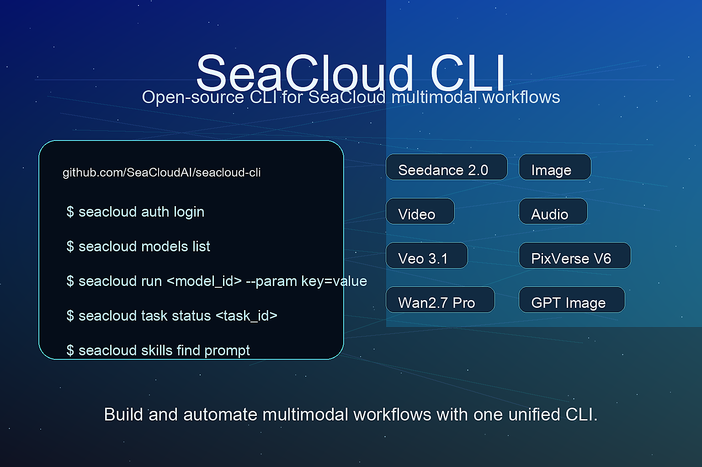

<div align="center">
  <p>
    
  </p>
  <h1>SeaCloud CLI</h1>
  <h3>The official CLI for the SeaCloud AI Platform</h3>
  <p>
    SeaCloud CLI is a multimodal task execution CLI designed specifically for
    Agents. With one SeaCloud API Key, it provides unified access to LLM, image,
    video, audio, 3D, and other models; supports model search, spec queries, task
    execution, and result tracking; manages cloud sandboxes and templates for
    agent workloads; and helps discover and manage professional skills for
    creative workflows through SkillHub.
  </p>
  <p>
    <a href="https://www.npmjs.com/package/@seacloudai/seacloud-cli">
      
    </a>
    
    = 18">
    = 1.26">
  </p>
  <p>
    <a href="./README.zh.md">中文文档</a>
    ·
    <a href="https://cloud.seaart.ai/">Official Website</a>
  </p>
</div>

## Features

- **Authentication**: Sign in with the browser-based device flow and store credentials locally.
- **Model discovery**: List available models and inspect full parameter specs in human-readable or JSON form.
- **Task execution**: Submit multimodal generation tasks from the CLI with parameter validation and structured output options.
- **Image model execution**: Generate images through `seacloud run` or submit image tasks asynchronously with `seacloud run-async`.
- **LLM model execution**: Use `seacloud llm run` when a command must accept only LLM contract models.
- **Task tracking**: Poll task status and print result URLs or full JSON responses.
- **Sandbox workloads**: Create, connect to, execute commands in, observe, and clean up SeaCloud sandboxes with E2B-compatible command shapes.
- **SkillHub integration**: Search, install, and configure agent skills from SeaCloud SkillHub.
- **Agent-friendly UX**: Supports `--dry-run`, JSON output, output limits, actionable errors, stable command shapes, and copy-pasteable examples.

## Install

### Install with npm

```bash
npm install -g @seacloudai/seacloud-cli
```

> Requires Node.js 18+

The npm installer also best-effort deploys a thin Gateway Skill to your agent
skills directory so new agent sessions can discover `seacloud`. Skill deployment
failures are reported as warnings and do not block the CLI binary install. Set
`SEACLOUD_SKIP_SKILL_DEPLOY=1` to skip this step.

Before an agent runs real SeaCloud commands, it should load the current CLI
capabilities from the installed binary:

```bash
seacloud agent describe
```

### Install from source

Default install:

```bash
git clone https://github.com/SeaCloudAI/seacloud-cli.git
cd seacloud-cli
make install
```

> Requires Go 1.26+
> The installed binary uses the default public service endpoints. In managed runtimes that inject `GATEWAY_URL` plus a managed token, Vtrix generation requests can be rewritten through the runtime proxy automatically.

If `/usr/local/bin` requires elevated permissions:

```bash
sudo make install
```

If you prefer a user-local install without `sudo`:

```bash
make install PREFIX=$HOME/.local
export PATH="$HOME/.local/bin:$PATH"
```

### Download binaries

Prebuilt binaries are published on the [Releases](https://github.com/SeaCloudAI/seacloud-cli/releases) page for:

- macOS `amd64`
- macOS `arm64`
- Linux `amd64`
- Linux `arm64`
- Windows `amd64`

## Quick Start

### Authenticate

```bash
seacloud auth login
seacloud auth status
```

### Check account balance

```bash
seacloud account balance
seacloud account balance --output json
```

### Browse models

```bash
seacloud models list
seacloud models list --provider blackforestlabs
seacloud models spec gpt_image_2
seacloud models spec gpt_image_2 --output json
```

### Run a task

```bash
seacloud run gpt_image_2 \
  --param prompt="a cute golden retriever puppy on a white studio background" \
  --param n=1 \
  --param size=1024x1024 \
  --param output_format=png \
  --output json
```

### Generate a video

```bash
seacloud run pixverse_v6_t2v \
  --param prompt="a cinematic shot of a golden retriever puppy running through a sunlit field" \
  --param aspect_ratio=16:9 \
  --param duration=5 \
  --param quality=720p \
  --output json
```

Use model IDs returned by `seacloud models list`, then inspect the exact
parameter contract with `seacloud models spec <model_id>` before running.

### Run an LLM model only

```bash
seacloud llm run claude-opus-4-6 \
  --param messages='[{"role":"user","content":"hello"}]'

seacloud llm run claude-opus-4-6 \
  --stream \
  --param messages='[{"role":"user","content":"hello"}]'
```

`seacloud llm run` accepts only LLM contracts. Use `seacloud run <model_id>`
for image, video, audio, 3D, queue, or legacy generation models.

`claude-opus-4-6` is a verified LLM smoke-test model. Add
`--param max_tokens=8` for a short, low-cost test response, and use
`--output json` or `--output sse` when automation needs structured output.

### Submit without waiting

```bash
seacloud run-async gpt_image_2 --param prompt="A flat vector poster of a blue cat wearing black sunglasses"
seacloud run-async gpt_image_2 --param prompt="A flat vector poster of a blue cat wearing black sunglasses" --output id
```

### Check task status

```bash
seacloud task status <task_id>
seacloud task status <task_id> --output url
seacloud task status <task_id> --output json
```

### Manage skills

```bash
seacloud skills list
seacloud skills list --output json
seacloud skills find prompt
seacloud skills find prompt --output json
seacloud skills add some-skill
seacloud skills config --show
```

### Manage sandboxes

```bash
seacloud sandbox create base
seacloud sandbox create base --no-connect --wait
seacloud sandbox list --state running,paused --output json
seacloud sandbox exec <sandbox_id> ls -la
seacloud sandbox connect <sandbox_id>
seacloud sandbox kill <sandbox_id>
```

## Commands

### `seacloud auth`

```bash
seacloud auth login
seacloud auth status
seacloud auth logout
seacloud auth set-key <api-key>
```

### `seacloud agent`

```bash
seacloud agent describe
```

### `seacloud account`

```bash
seacloud account balance
seacloud account balance --output json
```

### `seacloud models`

```bash
seacloud models list
seacloud models list --keywords gpt
seacloud models list --provider blackforestlabs
seacloud models list --output id
seacloud models spec <model_id>
seacloud models spec <model_id> --output json
```

### `seacloud run`

```bash
seacloud run gpt_image_2 --param prompt="a blue cat" --param n=1 --param size=1024x1024 --param output_format=png --output json
seacloud run gpt_image_2 --param prompt="a blue cat" --param n=1 --param size=1024x1024 --param output_format=png --output url
seacloud run pixverse_v6_t2v --param prompt="a puppy running through a sunlit field" --param aspect_ratio=16:9 --param duration=5 --param quality=720p --output json
```

Nested fields use dot notation:

```bash
seacloud run some_model \
  --param camera_control.type=simple \
  --param camera_control.speed=2
```

### `seacloud llm run`

```bash
seacloud llm run claude-opus-4-6 --param messages='[{"role":"user","content":"hello"}]'
seacloud llm run claude-opus-4-6 --stream --param messages='[{"role":"user","content":"hello"}]'
seacloud llm run gpt_5_mini --param input=hello --output json
```

This is an LLM-only wrapper around the same contract-driven LLM execution path
used by `seacloud run`.

`claude-opus-4-6` resolves to a `model-contract.v1` LLM contract with
`llm_chat_completions` and `openai_chat_json`. Non-streaming calls return a
`chat.completion` response; streaming calls return SSE chunks ending with
`data: [DONE]`.

### `seacloud task`

```bash
seacloud task status <task_id>
```

### `seacloud skills`

```bash
seacloud skills list
seacloud skills list --output json
seacloud skills find [query]
seacloud skills find [query] --output json
seacloud skills add <slug>
seacloud skills config --show
```

### `seacloud run-async`

```bash
seacloud run-async gpt_image_2 --param prompt="a blue cat"
seacloud run-async gpt_image_2 --param prompt="a blue cat" --output json
seacloud run-async gpt_image_2 --param prompt="a blue cat" --output id
```

### `seacloud sandbox`

Core sandbox commands follow the E2B CLI shape:

```bash
seacloud sandbox create [template]
seacloud sandbox create base --no-connect --wait
seacloud sandbox list --state running,paused --metadata app=agent --limit 10 --next-token <token>
seacloud sandbox exec <sandbox_id> "python --version"
seacloud sandbox exec --background <sandbox_id> "sleep 60 && echo done"
seacloud sandbox exec --cwd /workspace --user root --env NODE_ENV=production <sandbox_id> node app.js
seacloud sandbox connect <sandbox_id> --shell bash
seacloud sandbox kill <sandbox_id>
seacloud sandbox kill --all --state running,paused
seacloud sandbox metrics <sandbox_id>
seacloud sandbox metrics <sandbox_id_1> <sandbox_id_2> --output json
```

SeaCloud sandbox API features exposed by the SDKs are also available:

```bash
seacloud sandbox create base --no-connect --wait --output json --metadata app=agent --timeout 3600
seacloud sandbox create base --auto-resume --allow-internet-access=false --allow-out 1.1.1.1 --volume-mount cache:/cache
seacloud sandbox network update <sandbox_id> --allow-public-traffic=true --deny-out 10.0.0.0/8
seacloud sandbox logs <sandbox_id> --limit 100 --direction backward
seacloud sandbox pause <sandbox_id>
seacloud sandbox timeout <sandbox_id> --seconds 3600
seacloud sandbox refresh <sandbox_id> --duration 300

seacloud sandbox volume create cache
seacloud sandbox volume list
seacloud sandbox volume get <volume_id>
seacloud sandbox volume delete <volume_id>

seacloud sandbox events --type sandbox.lifecycle.created
seacloud sandbox webhook create --name lifecycle --url https://example.com/webhook --secret whsec_... --event sandbox.lifecycle.created --max-attempts 5 --delay-seconds 1,5,30
seacloud sandbox webhook update <webhook_id> --enabled=false
seacloud sandbox webhook deliveries --status failed
seacloud sandbox webhook replay <delivery_id>

seacloud sandbox team list
seacloud sandbox team metrics <team_id> --start 1710000000 --end 1710003600
seacloud sandbox team metrics-max <team_id> --metric concurrent_sandboxes
seacloud sandbox observability
```

`seacloud sandbox create <template>` follows E2B's interactive behavior when run in a terminal: it creates the sandbox, connects a shell, and kills the sandbox when the shell exits. Use `--no-connect` or `--output json` for automation.

Recommended automation flow:

```bash
seacloud auth status
seacloud sandbox create base --no-connect --wait --output json --metadata app=agent
seacloud sandbox exec <sandbox_id> "python --version"
seacloud sandbox logs <sandbox_id> --limit 100 --direction backward --output json
seacloud sandbox metrics <sandbox_id> --output json
seacloud --dry-run sandbox kill <sandbox_id>
seacloud sandbox kill <sandbox_id>
```

For bulk cleanup, always preview filters first:

```bash
seacloud --dry-run sandbox kill --all --state running,paused --metadata app=agent
seacloud sandbox kill --all --state running,paused --metadata app=agent
```

### `seacloud template`

Template commands provide the E2B migration surface for local template projects and build operations:

```bash
seacloud template init --language typescript --name my-template
seacloud template migrate --language python --name my-template
seacloud template build my-template --dockerfile Dockerfile
seacloud template build my-template --image python:3.13 --cpu-count 2 --memory-mb 2048 --tag v1
seacloud template build my-template --from-template base --no-wait
seacloud template list --format json
seacloud template get my-template
seacloud template builds my-template
seacloud template status <template_id> <build_id>
seacloud template logs <template_id> <build_id> --limit 100
seacloud template tags assign my-template:v1 production stable
seacloud template tags list my-template
seacloud template tags remove my-template staging
seacloud template delete my-template
```

### `seacloud version`

```bash
seacloud version
```

## Output and Automation

- Use `--output json` where supported for machine-readable responses.
- Use `--format json` on sandbox/template commands for E2B-compatible output flag naming.
- Use `--output url` on task commands to print only result URLs.
- Use `seacloud llm run <model_id>` when the selected model must be an LLM contract.
- Use `seacloud run-async <model_id>` when automation should submit a task and return a task ID without polling.
- Use `seacloud models spec <model_id> --output json` before running a model to inspect parameters and examples.
- Sandbox and template commands use your SeaCloud login session. Run `seacloud auth login` before calling them.
- For agent automation, create sandboxes with `--no-connect --wait --output json`, keep the returned sandbox ID, and clean it up explicitly with `seacloud sandbox kill <sandbox_id>`.
- Use global `--dry-run` before write/delete/replay operations. Dry-run output shows the method, path, body/query, destructive status, and the next step.
- Use `--limit`, `--next-token`, `--cursor`, or `--offset` on list/log/event commands to keep responses small.
- Parameter errors include the invalid field, what is wrong, and a suggested command or flag to fix it.

Example:

```bash
seacloud models spec gpt_image_2 --output json
seacloud --dry-run run gpt_image_2 --param prompt=test --param n=1 --param size=1024x1024 --param output_format=png
seacloud --dry-run sandbox webhook create --name lifecycle --url https://example.com/webhook --secret whsec_...
```

## Release

Release assets are built from source and published to GitHub Releases.  
The npm package downloads the matching prebuilt binary for the user platform during installation.

If you maintain releases manually, the repository includes:

- `scripts/build.sh`
- `.goreleaser.yml`
- `scripts/set-release-version.js`

## Repository Layout

```text
seacloud-cli/
├── cmd/                     # Cobra command definitions and command tests
├── internal/account/        # Account balance API client
├── internal/agentdescribe/  # Agent capability descriptions
├── internal/auth/           # Auth client and login flow
├── internal/buildinfo/      # Version and build metadata
├── internal/clierrors/      # Actionable CLI error formatting
├── internal/config/         # Local config, auth, and managed runtime helpers
├── internal/contracts/      # model-contract.v1 fetch, cache, and validation
├── internal/generation/     # Generation response parsing and legacy helpers
├── internal/modelendpoints/ # Model/spec endpoint defaults and overrides
├── internal/models/         # Model list, aliases, and spec lookup
├── internal/queue/          # Queue submit, polling, and result clients
├── internal/sandbox/        # Sandbox and template API client
├── internal/skillhub/       # SkillHub search, install, and config logic
├── internal/taskcache/      # Local queue task metadata cache
├── assets/                  # README banners and Gateway Skill source
├── docs/                    # Design notes and migration plans
├── package.json             # npm package manifest
├── scripts/                 # Build, release, Gateway Skill, and npm wrapper scripts
└── skills/                  # Built-in skill definitions
```

## Contributing

Issues and pull requests are welcome. Before sending larger changes, it is best to open an issue first so the scope can be discussed.

For local verification:

```bash
go test ./...
go run . --help
```
