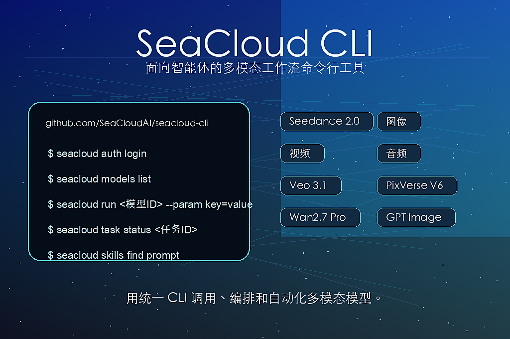

<div align="center">
  <p>
    
  </p>
  <h1>SeaCloud CLI</h1>
  <h3>SeaCloud AI 平台的官方命令行界面</h3>
  <p>
    SeaCloud CLI 是专为 Agent 设计的多模态任务执行 CLI，可通过一个 API Key
    统一调用 LLM、图像、视频、音频、3D 等模型，支持模型查找、规格查询、任务执行、结果追踪，并通过
    SkillHub 发现和管理面向创意工作流的专业技能。
  </p>
  <p>
    <a href="https://www.npmjs.com/package/@seacloudai/seacloud-cli">
      
    </a>
    
    = 18">
    = 1.26">
  </p>
  <p>
    <a href="./README.md">English</a>
    ·
    <a href="https://cloud.seaart.ai/">SeaCloud官网</a>
  </p>
</div>

## 功能特性

- **认证登录**：支持浏览器设备码登录，并将凭证安全保存在本地。
- **模型发现**：列出可用模型，并以可读文本或 JSON 查看完整参数规格。
- **任务执行**：通过 CLI 提交多模态生成任务，支持参数校验和结构化输出。
- **图片模型执行**：通过 `seacloud run` 生成图片，或使用 `seacloud run-async` 异步提交图片任务。
- **任务追踪**：轮询任务状态，输出结果 URL 或完整 JSON。
- **SkillHub 集成**：搜索、安装和配置 SeaCloud SkillHub 技能。
- **Agent 友好**：支持 `--dry-run`、JSON 输出、输出限量、可操作错误、稳定命令结构和可直接复制的示例。

## 安装

### 使用 npm 安装

```bash
npm install -g @seacloudai/seacloud-cli
```

> 需要 Node.js 18+

npm 安装器还会 best-effort 部署一份很薄的 Gateway Skill 到 Agent 技能目录，
让新的 Agent 会话能发现 `seacloud`。Skill 部署失败只会输出 warning，
不会阻断 CLI 二进制安装。可设置 `SEACLOUD_SKIP_SKILL_DEPLOY=1` 跳过这一步。

Agent 执行真实 SeaCloud 命令前，应先从已安装的二进制读取当前 CLI 能力说明：

```bash
seacloud agent describe
```

### 从源码安装

默认安装方式：

```bash
git clone https://github.com/SeaCloudAI/seacloud-cli.git
cd seacloud-cli
make install
```

> 需要 Go 1.26+
> 安装后的二进制会注入公开版本使用的默认服务地址。在会注入 `GATEWAY_URL` 和托管 token 的运行时里，Vtrix 生成请求可以自动改写到运行时代理。

如果 `/usr/local/bin` 需要更高权限：

```bash
sudo make install
```

如果你想在无 `sudo` 的情况下安装到用户目录：

```bash
make install PREFIX=$HOME/.local
export PATH="$HOME/.local/bin:$PATH"
```

### 下载预编译二进制

预编译二进制发布在 [Releases](https://github.com/SeaCloudAI/seacloud-cli/releases) 页面，当前支持：

- macOS `amd64`
- macOS `arm64`
- Linux `amd64`
- Linux `arm64`
- Windows `amd64`

## 快速开始

### 登录认证

```bash
seacloud auth login
seacloud auth status
```

### 查询账户余额

```bash
seacloud account balance
seacloud account balance --output json
```

### 查询模型

```bash
seacloud models list
seacloud models spec gpt_image_2
seacloud models spec gpt_image_2 --output json
```

### 执行任务

```bash
seacloud run gpt_image_2 \
  --param prompt="a cute golden retriever puppy on a white studio background" \
  --param n=1 \
  --param size=1024x1024 \
  --param output_format=png \
  --output json
```

请使用 `seacloud models list` 返回的模型 ID，并在执行前通过
`seacloud models spec <model_id>` 查看该模型的准确参数合约。

### 只提交任务，不等待结果

```bash
seacloud run-async gpt_image_2 --param prompt="A flat vector poster of a blue cat wearing black sunglasses"
seacloud run-async gpt_image_2 --param prompt="A flat vector poster of a blue cat wearing black sunglasses" --output id
```

### 查询任务状态

```bash
seacloud task status <task_id>
seacloud task status <task_id> --output url
seacloud task status <task_id> --output json
```

### 管理技能

```bash
seacloud skills list
seacloud skills list --output json
seacloud skills find prompt
seacloud skills find prompt --output json
seacloud skills add some-skill
seacloud skills config --show
```

### 管理沙箱

```bash
seacloud sandbox create base
seacloud sandbox create base --no-connect --wait
seacloud sandbox list --state running,paused --format json
seacloud sandbox exec <sandbox_id> ls -la
seacloud sandbox connect <sandbox_id>
seacloud sandbox kill <sandbox_id>
```

## 命令概览

### `seacloud auth`

```bash
seacloud auth login
seacloud auth status
seacloud auth logout
seacloud auth set-key <api-key>
```

### `seacloud agent`

```bash
seacloud agent describe
```

### `seacloud account`

```bash
seacloud account balance
seacloud account balance --output json
```

### `seacloud models`

```bash
seacloud models list
seacloud models list --keywords gpt
seacloud models list --output id
seacloud models spec <model_id>
seacloud models spec <model_id> --output json
```

### `seacloud run`

```bash
seacloud run gpt_image_2 --param prompt="一只蓝色猫" --param n=1 --param size=1024x1024 --param output_format=png --output json
seacloud run gpt_image_2 --param prompt="一只蓝色猫" --param n=1 --param size=1024x1024 --param output_format=png --output url
```

嵌套字段支持 dot notation：

```bash
seacloud run some_model \
  --param camera_control.type=simple \
  --param camera_control.speed=2
```

### `seacloud task`

```bash
seacloud task status <task_id>
```

### `seacloud skills`

```bash
seacloud skills list
seacloud skills list --output json
seacloud skills find [query]
seacloud skills find [query] --output json
seacloud skills add <slug>
seacloud skills config --show
```

### `seacloud run-async`

```bash
seacloud run-async gpt_image_2 --param prompt="一只蓝色猫"
seacloud run-async gpt_image_2 --param prompt="一只蓝色猫" --output json
seacloud run-async gpt_image_2 --param prompt="一只蓝色猫" --output id
```

### `seacloud sandbox`

核心沙箱命令对齐 E2B CLI 的命令形态：

```bash
seacloud sandbox create [template]
seacloud sandbox create base --no-connect --wait
seacloud sandbox list --state running,paused --metadata app=agent --limit 10 --next-token <token>
seacloud sandbox exec <sandbox_id> "python --version"
seacloud sandbox exec --background <sandbox_id> "sleep 60 && echo done"
seacloud sandbox exec --cwd /workspace --user root --env NODE_ENV=production <sandbox_id> node app.js
seacloud sandbox connect <sandbox_id> --shell bash
seacloud sandbox kill <sandbox_id>
seacloud sandbox kill --all --state running,paused
seacloud sandbox metrics <sandbox_id>
seacloud sandbox metrics <sandbox_id_1> <sandbox_id_2> --output json
```

三端 SDK 已支持的 SeaCloud 沙箱能力也已暴露到 CLI：

```bash
seacloud sandbox create base --auto-resume --allow-internet-access=false --allow-out 1.1.1.1 --volume-mount cache:/cache
seacloud sandbox network update <sandbox_id> --allow-public-traffic=true --deny-out 10.0.0.0/8
seacloud sandbox logs <sandbox_id> --limit 100 --direction backward
seacloud sandbox pause <sandbox_id>
seacloud sandbox timeout <sandbox_id> --seconds 3600
seacloud sandbox refresh <sandbox_id> --duration 300

seacloud sandbox volume create cache
seacloud sandbox volume list
seacloud sandbox volume get <volume_id>
seacloud sandbox volume delete <volume_id>

seacloud sandbox events --type sandbox.lifecycle.created
seacloud sandbox webhook create --name lifecycle --url https://example.com/webhook --secret whsec_... --event sandbox.lifecycle.created --max-attempts 5 --delay-seconds 1,5,30
seacloud sandbox webhook update <webhook_id> --enabled=false
seacloud sandbox webhook deliveries --status failed
seacloud sandbox webhook replay <delivery_id>

seacloud sandbox team list
seacloud sandbox team metrics <team_id> --start 1710000000 --end 1710003600
seacloud sandbox observability
```

`seacloud sandbox create <template>` 在交互终端中会按 E2B 习惯工作：创建沙箱、连接 shell、退出 shell 后删除沙箱。脚本化创建请使用 `--no-connect` 或 `--output json`。

### `seacloud template`

模板命令提供 E2B 迁移所需的本地模板项目和构建操作：

```bash
seacloud template init --language typescript --name my-template
seacloud template migrate --language python --name my-template
seacloud template build my-template --dockerfile Dockerfile
seacloud template build my-template --image python:3.13 --cpu-count 2 --memory-mb 2048 --tag v1
seacloud template build my-template --from-template base --no-wait
seacloud template list --format json
seacloud template get my-template
seacloud template builds my-template
seacloud template status <template_id> <build_id>
seacloud template logs <template_id> <build_id> --limit 100
seacloud template tags assign my-template:v1 production stable
seacloud template tags list my-template
seacloud template tags remove my-template staging
seacloud template delete my-template
```

### `seacloud version`

```bash
seacloud version
```

## 自动化与输出

- 在支持的命令上使用 `--output json` 获取机器可读输出。
- sandbox/template 命令也支持 `--format json`，用于兼容 E2B 的输出参数命名。
- 在任务命令上使用 `--output url` 只打印结果 URL。
- 自动化只需要提交任务 ID、不等待轮询时，使用 `seacloud run-async <model_id>`。
- 只有队列模型执行需要切换到非默认生成 API 根地址时，才设置 `SEACLOUD_GENERATION_URL`。
- sandbox/template 命令使用 SeaCloud 登录态；调用前先运行 `seacloud auth login`。
- 只有需要切换沙箱 API 根地址时才设置 `SEACLOUD_SANDBOX_URL` 或 `SEACLOUD_BASE_URL`。默认地址是 `https://cloud.seaart.ai/api/v1`。
- 调用 events、webhooks、volumes、teams、metrics 等带作用域的沙箱 API 时，可设置 `SEACLOUD_NAMESPACE_ID`、`SEACLOUD_USER_ID`、`SEACLOUD_PROJECT_ID`。
- 写入、删除、重放这类操作前先使用全局 `--dry-run`。dry-run 输出会展示 method、path、body/query、是否破坏性操作和下一步提示。
- list/log/event 类命令使用 `--limit`、`--next-token`、`--cursor` 或 `--offset` 控制输出量。
- 参数错误会包含哪个字段出错、错在哪里，以及建议执行的修复命令或参数。

示例：

```bash
seacloud --dry-run run gpt_image_2 --param prompt=test --param n=1 --param size=1024x1024 --param output_format=png
seacloud --dry-run sandbox webhook create --name lifecycle --url https://example.com/webhook --secret whsec_...
```

## 发布说明

发布产物由源码构建后上传到 GitHub Releases。  
npm 包在安装时会自动下载当前平台对应的预编译二进制。

如果你需要手动维护发布流程，仓库中保留了这些文件：

- `scripts/build.sh`
- `.goreleaser.yml`
- `scripts/set-release-version.js`

## 仓库结构

```text
seacloud-cli/
├── cmd/                     # Cobra 命令定义和命令测试
├── internal/account/        # 账户余额接口客户端
├── internal/agentdescribe/  # Agent 能力说明
├── internal/auth/           # 认证客户端与登录流程
├── internal/buildinfo/      # 版本与构建元数据
├── internal/clierrors/      # 可操作错误信息格式化
├── internal/config/         # 本地配置、认证与托管运行时辅助逻辑
├── internal/contracts/      # model-contract.v1 拉取、缓存与校验
├── internal/generation/     # 生成结果解析与旧生成流程辅助逻辑
├── internal/modelendpoints/ # 模型/规格接口默认地址与覆盖逻辑
├── internal/models/         # 模型列表、别名与规格查询
├── internal/queue/          # 队列提交、轮询与结果客户端
├── internal/sandbox/        # 沙箱与模板接口客户端
├── internal/skillhub/       # SkillHub 搜索、安装与配置逻辑
├── internal/taskcache/      # 本地队列任务元数据缓存
├── assets/                  # README 图片与 Gateway Skill 源文件
├── docs/                    # 设计说明与迁移计划
├── package.json             # npm 包清单
├── scripts/                 # 构建、发版、Gateway Skill 与 npm 包装脚本
└── skills/                  # 内置技能定义
```

## 参与贡献

欢迎提交 Issue 和 Pull Request。对于较大的改动，建议先开一个 Issue 讨论范围。

本地验证可使用：

```bash
go test ./...
go run . --help
```
